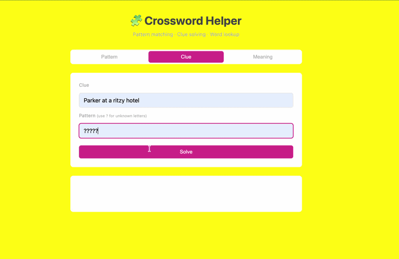
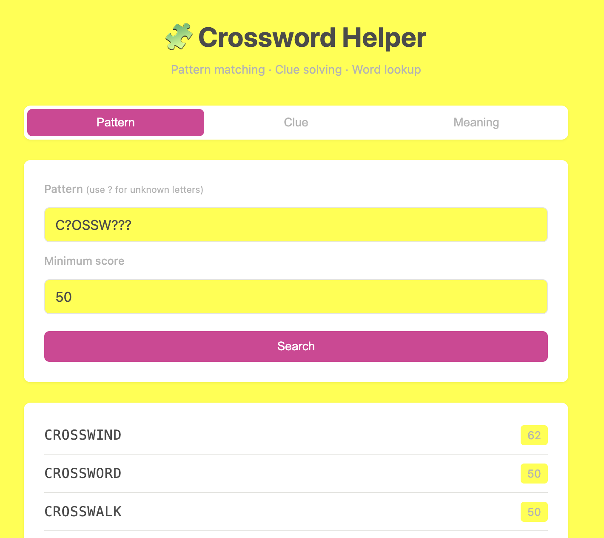
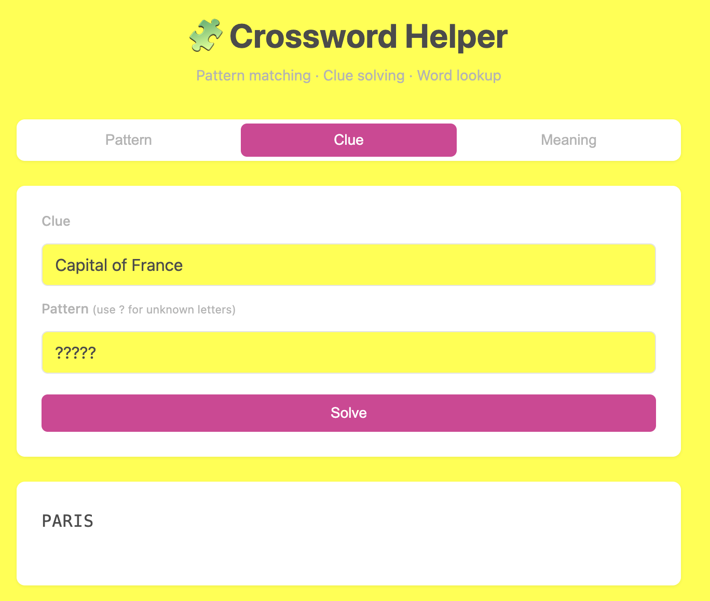
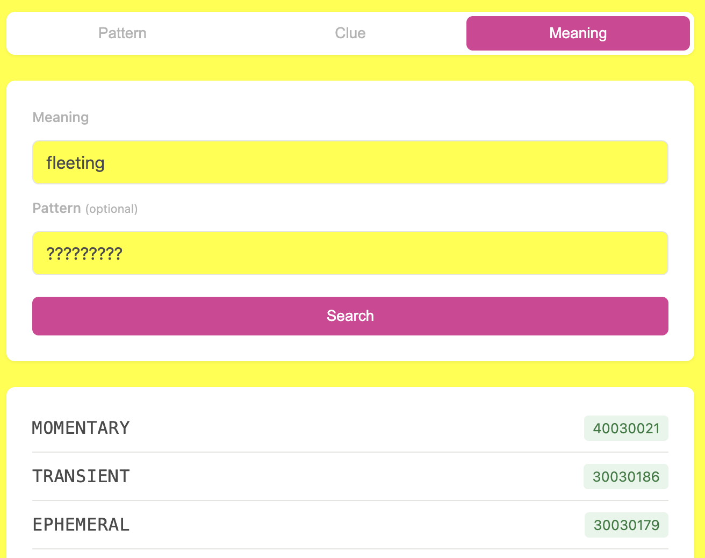

# Crossword Assistant

A full-stack crossword solving tool combining pattern matching, LLM-powered clue interpretation, and semantic word lookup.



## What it does

Crossword Helper solves the three main problems you hit when stuck on a crossword:

- **Pattern matching** — "I know the answer is C?OSSW?RD" → CROSSWORD
- **Clue interpretation** — "Capital of France" + ????? → PARIS
- **Meaning-based lookup** — "fleeting" + 9 letters or pattern → EPHEMERAL

Built with Python (Flask backend), vanilla JavaScript (frontend), the Anthropic API (Claude Haiku 4.5 for clue solving), and the Datamuse API (for semantic word search).

## Screenshots

### Pattern matching


### Clue solving (LLM-powered)


### Meaning-based search


## How it works

The tool layers a few different search strategies, each backed by a different data source:

| Search type | Data source | How it works |
|-------------|-------------|--------------|
| Pattern | Local wordlist (Peter Broda, ~500k entries) | Regex match against wildcard pattern |
| Clue | Anthropic Claude API | LLM suggests candidates; results filtered against pattern + wordlist |
| Meaning | Datamuse API | Semantic word search with optional pattern constraint |

The wordlist is the [Peter Broda "Spread the Wordlist"](https://peterbroda.me/crosswords/wordlist/), which includes quality scores 0–100 that crossword constructors use to rank answers. Results are sorted by these scores so common, high-quality answers surface first.

For clue solving, the LLM is asked for candidate answers given the clue and pattern. The candidates are then validated against the actual regex pattern (because LLMs occasionally suggest wrong-length or wrong-letter answers) and cross-referenced against the wordlist (to flag potential hallucinations).

## Tech stack

- **Backend:** Python, Flask, Flask-CORS
- **Frontend:** HTML, CSS, vanilla JavaScript (no framework)
- **APIs:** Anthropic (Claude Haiku 4.5), Datamuse
- **Data:** Peter Broda crossword wordlist with quality scores

## Running locally

### Requirements
- Python 3.9+
- An Anthropic API key (free tier available)

### Setup

```bash
git clone https://github.com/c-k-bull/crossword-helper.git
cd crossword-helper
python -m venv venv
source venv/bin/activate   # On Windows: venv\Scripts\activate
pip install -e .
```

### Configure API key

Set your Anthropic API key as an environment variable:

```bash
export ANTHROPIC_API_KEY="your-key-here"
```

To make it permanent on Mac, add the line above to `~/.zshrc`.

### Run

```bash
python -m crosshelp.web
```

A browser tab opens automatically at `http://127.0.0.1:5000`.

## Project structure
crosshelp/
├── patterns.py      # Wordlist loading + regex pattern matching
├── anagram.py       # Anagram solver
├── clue.py          # LLM-powered clue solver (Anthropic API)
├── synonyms.py      # Meaning lookup (Datamuse API)
├── web.py           # Flask backend
├── templates/
│   └── index.html   # Frontend HTML
├── static/
│   ├── styles.css   # Frontend styles
│   └── app.js       # Frontend JavaScript
└── data/
└── wordlist.txt # Peter Broda wordlist with scores

## Limitations

- **Clue solving requires an API key** and uses paid API credits (cents per query).
- **Wordlist is static** — words added to crosswords after July 2023 (the wordlist's release date) won't appear.
- **Meaning search depends on Datamuse** being reachable; no offline fallback for that mode.
- **LLM hallucination** is mitigated but not eliminated. Wordlist cross-reference catches most made-up words, but unusual real words may incorrectly be flagged.

## Why I built this

Crosswords have been an integral part of my morning for about six years now (big fan of NYT Sundays), 
and I wanted a tool that people could go to to give them some hints in a bind without giving all of 
the answers away. This gave me an opportunity to learn full-stack development by building something I'd actually use. The project turned into a tour of useful patterns — regex matching, API integration, LLM prompt engineering, and combining all three behind a simple web UI.

## License

MIT