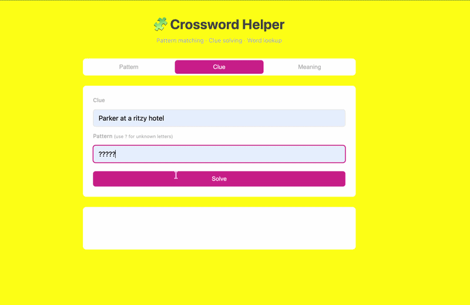
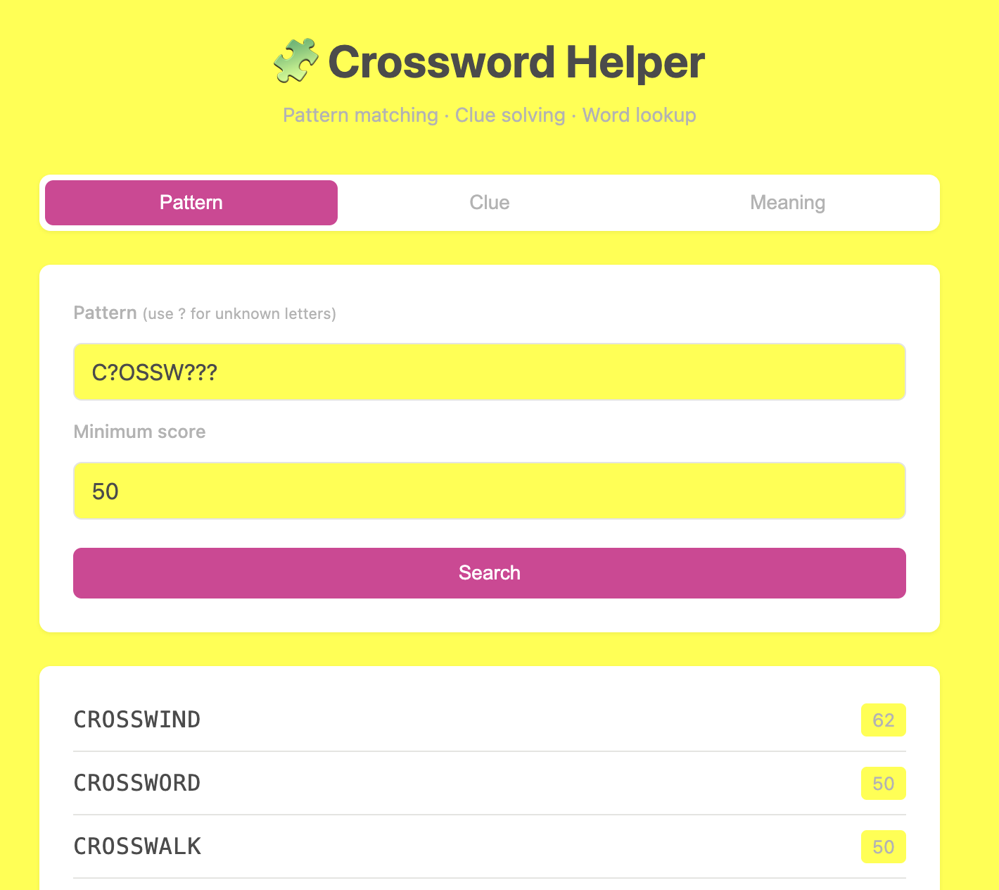
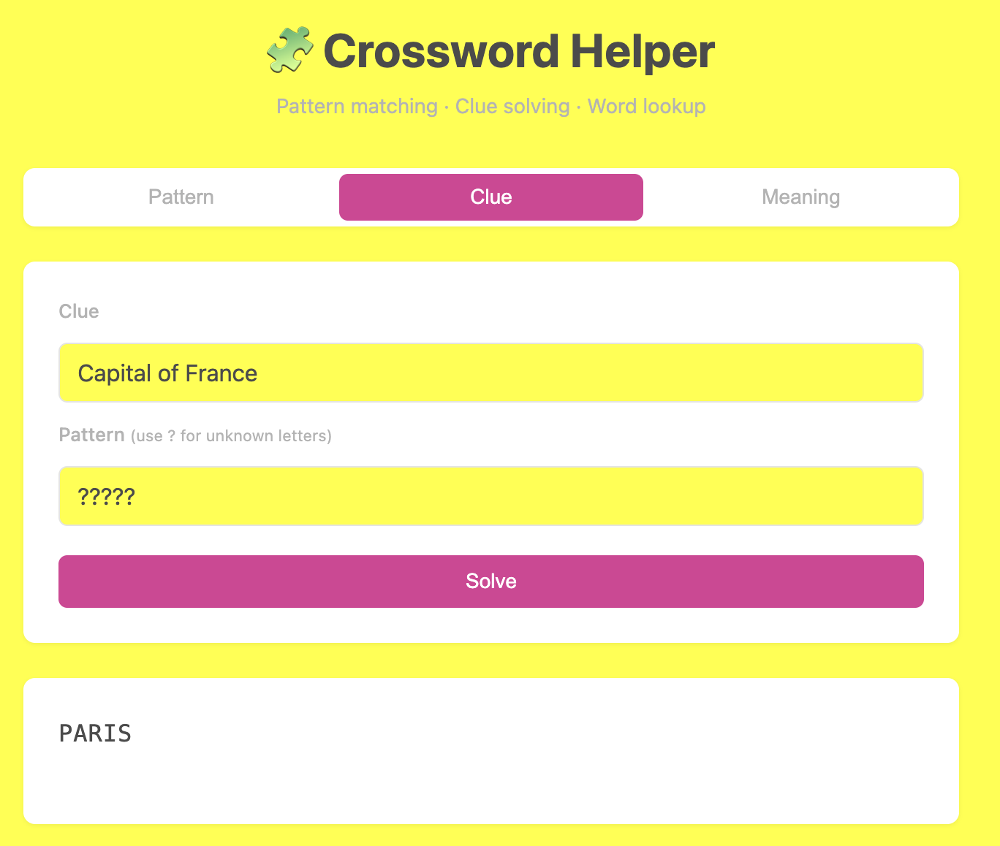
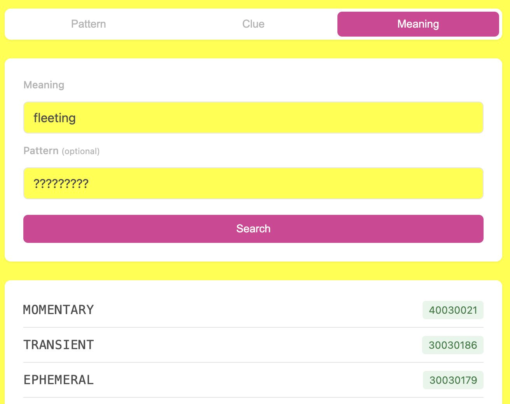

# Crossword Assistant

A full-stack crossword solving tool combining pattern matching, LLM-powered clue interpretation, and semantic word lookup.



## What it does

Crossword Helper solves the three main problems you hit when stuck on a crossword:

- **Pattern matching** — "I know the answer is C?OSSW?RD" → CROSSWORD
- **Clue interpretation** — "Capital of France" + ????? → PARIS
- **Meaning-based lookup** — "fleeting" + 9 letters or pattern → EPHEMERAL

Built with Python (Flask backend), vanilla JavaScript (frontend), the Anthropic API (Claude Haiku 4.5 for clue solving), and the Datamuse API (for semantic word search).

## Screenshots

### Pattern matching


### Clue solving (LLM-powered)


### Meaning-based search


## How it works

The tool layers a few different search strategies, each backed by a different data source:

| Search type | Data source | How it works |
|-------------|-------------|--------------|
| Pattern | Local wordlist (Peter Broda, ~500k entries) | Regex match against wildcard pattern |
| Clue | Anthropic Claude API | LLM suggests candidates; results filtered against pattern + wordlist |
| Meaning | Datamuse API | Semantic word search with optional pattern constraint |

The wordlist is the [Peter Broda "Spread the Wordlist"](https://peterbroda.me/crosswords/wordlist/), which includes quality scores 0–100 that crossword constructors use to rank answers. Results are sorted by these scores so common, high-quality answers surface first.

For clue solving, the LLM is asked for candidate answers given the clue and pattern. The candidates are then validated against the actual regex pattern (because LLMs occasionally suggest wrong-length or wrong-letter answers) and cross-referenced against the wordlist (to flag potential hallucinations).

## Model performance

The clue solver is evaluated against a held-out test set of NYT Monday crossword clues. The eval framework measures both **top-1 accuracy** (whether the model's first answer is correct) and **top-k accuracy** (whether the correct answer appears anywhere in the candidate list).

| Metric | Score | Examples |
|--------|-------|----------|
| Top-1 accuracy | 70.7% | 53/75 |
| Top-k accuracy | 78.7% | 59/75 |

Test set: 75 clues from NYT Monday puzzles, held out from prompt tuning. Train and test splits are kept disjoint to prevent data leakage; the system prompt uses general principles rather than specific clue examples.

Eval framework runs via `python evals/run_eval.py --split test --save`. Per-clue results are persisted to `evals/results/` for tracking improvements across iterations.

## Tech stack

- **Backend:** Python, Flask, Flask-CORS
- **Frontend:** HTML, CSS, vanilla JavaScript (no framework)
- **APIs:** Anthropic (Claude Haiku 4.5), Datamuse
- **Data:** Peter Broda crossword wordlist with quality scores

## Database

Search queries and user feedback are logged to PostgreSQL. The schema and query layer live in `crosshelp/db/`.

| Column | Type | Description |
|--------|------|-------------|
| `id` | SERIAL | Primary key |
| `mode` | TEXT | Search type (pattern/anagram/clue/synonym) |
| `pattern`, `clue`, `letters`, `meaning` | TEXT | Input fields per search type |
| `result_count` | INTEGER | Number of candidates returned |
| `top_result` | TEXT | First result, for spot-checks |
| `was_correct` | BOOLEAN | Defaults TRUE; flipped via user feedback |
| `corrected_answer` | TEXT | User-supplied correct answer, when reported |
| `created_at` | TIMESTAMP | Query time, auto-set by Postgres |

Indexes on `created_at`, `mode`, and `was_correct` keep recency, filter, and accuracy queries fast.

### User feedback loop

When the top recommendation is wrong, users can submit the correct answer via an inline form. Corrections are recorded in `corrected_answer` and flip `was_correct` to FALSE. Over time this builds a labeled dataset of (clue, pattern, correct answer) triples that can be used to expand the eval set or fine-tune future iterations.

Note: `was_correct = TRUE` is the default state for any search no user reported. The metric we can compute from this column is **reported-wrong rate**, which is a lower bound on the true error rate (most users won't bother reporting). True accuracy is measured via the held-out eval set in `evals/`.

### Setup

```bash
createdb crosshelp
psql crosshelp < crosshelp/db/schema.sql
```

The app reads `DATABASE_URL` from the environment, defaulting to `postgresql://localhost/crosshelp`.

## Running locally

### Requirements
- Python 3.9+
- An Anthropic API key (free tier available)

## Running with Docker

The entire stack (Flask app + PostgreSQL) is containerized via Docker Compose.

### Requirements
- Docker Desktop installed and running
- An Anthropic API key

### Run

```bash
export ANTHROPIC_API_KEY="your-key-here"
docker compose up
```

The app is available at `http://127.0.0.1:5000`. Postgres is exposed on `localhost:5432` if you want to inspect it directly.

To stop: `Ctrl+C`, or in another terminal `docker compose down`.

### Architecture

- **app**: Python 3.11 Flask backend, built from the local `Dockerfile`
- **db**: PostgreSQL 16 (Alpine), with schema auto-applied from `crosshelp/db/schema.sql` on first startup

Postgres data persists in a named volume (`postgres_data`) across container restarts. To wipe the database, run `docker compose down -v`.

### Setup

```bash
git clone https://github.com/c-k-bull/crossword-helper.git
cd crossword-helper
python -m venv venv
source venv/bin/activate   # On Windows: venv\Scripts\activate
pip install -e .
```

### Configure API key

Set your Anthropic API key as an environment variable:

```bash
export ANTHROPIC_API_KEY="your-key-here"
```

To make it permanent on Mac, add the line above to `~/.zshrc`.

### Run

```bash
python -m crosshelp.web
```

A browser tab opens automatically at `http://127.0.0.1:5000`.

## Running tests

The project includes a pytest test suite covering pattern matching, anagram logic, clue parsing, and web endpoints.

```bash
pip install -e ".[dev]"
pytest
```

To see test coverage:

```bash
pytest --cov=crosshelp --cov-report=term-missing
```

## Project structure
crosshelp/
├── patterns.py      # Wordlist loading + regex pattern matching
├── anagram.py       # Anagram solver
├── clue.py          # LLM-powered clue solver (Anthropic API)
├── synonyms.py      # Meaning lookup (Datamuse API)
├── web.py           # Flask backend
├── templates/
│   └── index.html   # Frontend HTML
├── static/
│   ├── styles.css   # Frontend styles
│   └── app.js       # Frontend JavaScript
└── data/
└── wordlist.txt # Peter Broda wordlist with scores

## Limitations

- **Clue solving requires an API key** and uses paid API credits (cents per query).
- **Wordlist is static** — words added to crosswords after July 2023 (the wordlist's release date) won't appear.
- **Meaning search depends on Datamuse** being reachable; no offline fallback for that mode.
- **LLM hallucination** is mitigated but not eliminated. Wordlist cross-reference catches most made-up words, but unusual real words may incorrectly be flagged.

## Why I built this

Crosswords have been an integral part of my morning for about six years now (big fan of NYT Sundays), 
and I wanted a tool that people could go to to give them some hints in a bind without giving all of 
the answers away. This gave me an opportunity to learn full-stack development by building something I'd actually use. The project turned into a tour of useful patterns — regex matching, API integration, LLM prompt engineering, and combining all three behind a simple web UI.

## License

MIT